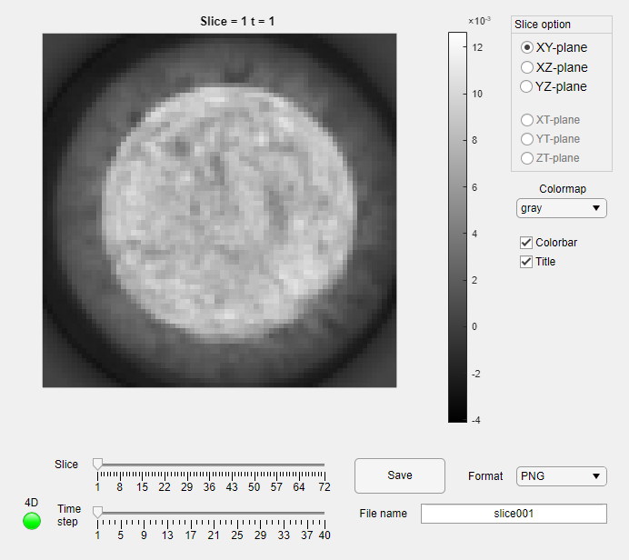

# sliceViewerApp
T H    2021

**Summary**

Matlab app designed for easy visualization of 3D volumes and 4D dynamic volumes as 2D slices.

Created 26.4.2021

**Description**

Matlab app desgined for easy visualization of high dimensional data such as 3D volumes and 4D dynamic volumes.
SliceViewer allows the user to browse trough different slices from the volume in almost any orientation and then to easily save the 2D slice images using variety of file format.
Colormap options allow the user to choose from Matlab default colormaps or give their own colormap. The intensity value is always normalized to [0 1] based on the OVERALL min and max intensity of the whole 4D (or 3D) volume in order to make visualizing the time evolutions meaningful.

**Installation**

Download the .mlapp-file **sliceViewerApp.mlapp** and run the app in Matlab with `sliceviewer(volume, colormap)`. Volume can be eitehr 3D or 4D and colormap is optional.

**Updates**

v1.0 - 26.4.2021
