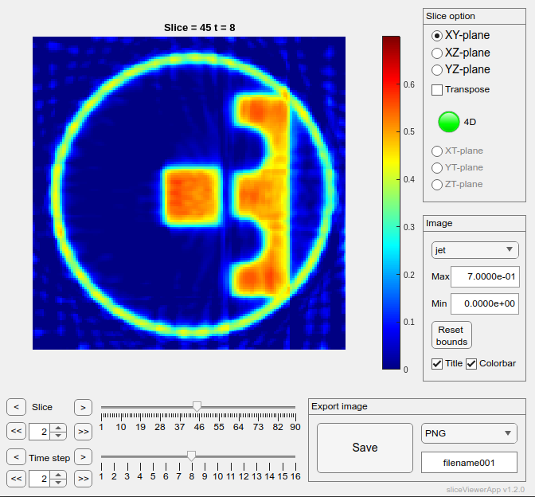

# sliceViewerApp

by Tommi Heikkilä  
v1.1.0

## Summary

Matlab app designed for easy visualization of 3D volumes and 4D dynamic volumes as 2D slices.

Created 26.4.2021  
Last changed 19.9.2023

## Description

Matlab app designed for easy visualization of high dimensional data such as 3D volumes and 4D dynamic volumes.
SliceViewer allows the user to browse through different slices from the volume in almost any orientation and then to easily save the 2D slice images using variety of file formats.
Colormap options allow the user to choose from Matlab default colormaps or use their own `custom` colormap.

By default the intensity value is always normalized to `[min(V(:)) max(V(:))]` based on the OVERALL min and max intensity of the whole 4D (or 3D) volume in order to make visualizing the time evolutions meaningful. These values can be tuned by the user to change the visualized color scale.

There are separate arrow and slider controls for changing the slice (3rd dimension by default) and the time step (4th dimension by default). The `<` and `>` buttons move one step, `<<` and `>>` use user set step length. This can be used to save every n'th time step, for example.

Saving the image saves the currently viewed slice using the set file format and name, after which the counter at the end of filename is increased. If `Title` and/or `Colorbar` are enabled, those are also included in the saved image.

## Installation

Download the .mlapp-file **sliceViewerApp.mlapp** and run the app in Matlab with `sliceViewerApp(volume, colormap)`. `Volume` can be either 3D or 4D array and the `colormap` is optional.

Opening the .mlapp-file itself will open the Matlab App Designer and allows customization by the user.

The .m-file **sliceViewerApp_exported.m** should contain identical code and it is obtained by exporting the app from the Matlab app editor into .m-file. **The exported file can not be used directly as a Matlab App!**

### To-Do

- Non-rectangular image scaling. This has been difficult.
- Gamma correction
- Better labels when visualizing funny orientations ('slice' and 't' are not very universal)

### Updates

- v1.1.0 - 16.8.2023: allowed tuning the visualized color scale
- v1.0.0 - 26.4.2021: initial upload
